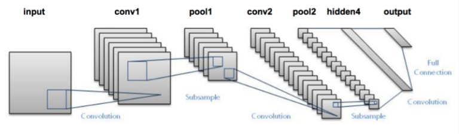

# Traffic-sign-classifier
### Overview

### Dependencies
This project requires **Python 3.5** and the following Python libraries installed:
- [Jupyter](http://jupyter.org/)
- [NumPy](http://www.numpy.org/)
- [Scipy](https://www.scipy.org/)
- [Scitkit-learn](http://scikit-learn.org/)
- [TensorFlow](http://tensorflow.org)
- [Matplotlib](http://matplotlib.org/)
- [Pandas](http://pandas.pydata.org/)
- [OpenCV](http://opencv.org) useful for image processing.
- [This](https://www.pyimagesearch.com/2015/07/20/install-opencv-3-0-and-python-3-4-on-ubuntu/) tutorial is very useful to install opencv. try this to install via conda `conda install -c https://conda.anaconda.org/menpo opencv3`.
- OpenCV can also be install with apt-get in Ubuntu.

### Dataset
- Dataset used is German Traffic Sign Recognition Bentchmark(GTSRB). [Download the dataset](http://benchmark.ini.rub.de/?section=gtsrb&subsection=dataset)  from here.
- The Training dataset contains 39,209 training images in 43 classes. The test dataset contains 12,630 test images.

### Model Architecture
The model is based on LeNet by Yann LeCun. It is a convolutional neural network designed to recognize visual patterns directly from pixel images with minimal preprocessing. It can handle hand-written characters very well too.

More about LeNet can be found in [this](http://yann.lecun.com/exdb/publis/pdf/lecun-98.pdf) paper published by it's author Yann LeCunn and Pierre Sermanet.

Our model is tweeked version of LeNet in which various modifications are done to improve the accuracy of model.
The Detail about our model is in [notebok file](https://github.com/Jargon4072/Traffic-sign-classifier/blob/master/Traffic-sign-classifier.ipynb) of this repository.

### Installation
As explained earlier the project uses Python 3.5 and several dependencies. Insatall correaponding dependencies and clone this repository by firing up terminal and running following command:

`git clone https://github.com/Jargon4072/Traffic-sign-classifier.git`

Now everything is good to go.
### Usage
train.py is usde for training the network and saving the checkpoint file generated in checkpoint folder. Configure corresponding paths in train.py and run it by follwing command:

`python3 train.py`

The path to be cofigured are:
- pipeline folder path. Make sure to downloade pipeline folder from [this](https://github.com/naokishibuya/car-traffic-sign-classification/tree/master/pipeline) link.
- Dataset path.

After training checkpoints will be saved in checkpoint folder. Load checkpoint and test the model by using test.py from following command:

`python3 test.py`

Make sure to provide above described paths in test.py.

The accuracy of model can also be checked by using test_accuracy.py file as follows:

`python3 test_accuracy.py`

Again don't forget to edit corresponding path in this one too.

